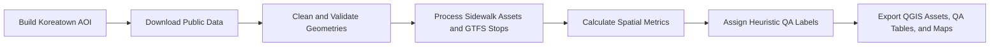

# AI-Ready Sidewalk Accessibility Dataset for Koreatown, Los Angeles

I built a QGIS-ready, AI-labeled pedestrian infrastructure dataset for Koreatown, Los Angeles by cleaning and validating public sidewalk, curb-ramp, driveway, crosswalk, intersection, street-centerline, and transit-stop data. The project exports GeoPackage and GeoJSON assets with transparent QA flags and heuristic labels for downstream geospatial AI review workflows.

This is not an ADA compliance audit. The labels are heuristic geospatial QA signals for data refinement, map review, and AI-ready asset preparation.

Live demo: https://btafreshian.github.io/koreatown-sidewalk-accessibility/

Interactive map: https://btafreshian.github.io/koreatown-sidewalk-accessibility/interactive_accessibility_map.html

## Why It Matters

Sidewalk accessibility data often lives across separate polygon, point, line, and tabular sources. This project demonstrates a reproducible workflow for turning public civic GIS data into a reviewable geospatial asset package: cleaned geometries, normalized attributes, transit context, proximity metrics, connectivity approximations, QA tables, and AI-ready heuristic labels.

## Data Sources

- LA City NavigateLA ArcGIS REST MapServer: sidewalks, access ramps, driveways, curbs, crosswalks, intersections, parkways, alley sidewalks, sidewalk boundaries, and street centerlines.
- LA Times Neighborhood Boundaries FeatureServer: Koreatown AOI polygon.
- LA Metro GTFS: bus and rail stops.
- OpenSidewalks schema: reference inspiration only, not a strict validation target.

See [docs/data_sources.md](docs/data_sources.md) for endpoints and fallback behavior.

## Workflow



## Reproduce Locally

```powershell
python -m venv .venv
.\.venv\Scripts\Activate.ps1
python -m pip install --upgrade pip
python -m pip install -r requirements.txt
python -m src.pipeline
python -m pytest
```

Make targets are also available:

```powershell
make install
make all
make test
make clean
```

## Generated Outputs

Large raw, interim, processed, and QGIS output files are generated locally and ignored by Git. After running the pipeline, review:

- `outputs/qgis/koreatown_sidewalk_accessibility.gpkg`
- `outputs/qgis/sidewalk_accessibility_labeled.geojson`
- `outputs/tables/qa_summary.csv`
- `outputs/tables/label_counts.csv`
- `outputs/tables/source_feature_counts.csv`
- `outputs/tables/transit_stop_counts.csv`
- `outputs/maps/final_accessibility_map.png`
- `outputs/html/interactive_accessibility_map.html`

The committed public demo lives in `docs/` for GitHub Pages.

## Labels

- `accessible`
- `missing_ramp`
- `disconnected`
- `obstacle_or_driveway_conflict`
- `needs_review`

The labeled layer preserves issue booleans and `label_reason` fields so reviewers can inspect why each feature received its label.

## Latest QA Snapshot

- 51,664 raw NavigateLA features downloaded.
- 40,122 clipped/cleaned NavigateLA features exported across source layers.
- 11,294 final sidewalk polygon features labeled.
- 272 bus/rail transit stops captured in or near the buffered AOI.
- Label counts: 6,982 `accessible`, 3,982 `obstacle_or_driveway_conflict`, 240 `missing_ramp`, 90 `needs_review`.

These counts reflect the latest successful pipeline run and may change as public source data changes.

## Limitations

- Labels are heuristic review signals, not legal ADA findings.
- The connectivity graph is an approximation built from nearby/touching sidewalk polygons, not a routable pedestrian network.
- Public source data can be incomplete, stale, or spatially generalized.
- Ramp presence comes from available source attributes and proximity rules, not field verification.

## Next Steps

- Add field-verified examples or street-level imagery review for selected issue clusters.
- Compare heuristic labels against OpenSidewalks-style schema fields.
- Add model-ready tiles or training samples for downstream geospatial AI workflows.
- Build QGIS layout screenshots for portfolio presentation.
