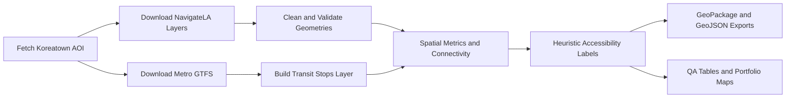

# AI-Ready Sidewalk Accessibility Dataset for Koreatown, Los Angeles

I built a QGIS-ready, AI-labeled pedestrian infrastructure dataset for Koreatown, Los Angeles by cleaning and validating public sidewalk, curb-ramp, driveway, crosswalk, intersection, street-centerline, and transit-stop data. The project exports GeoPackage and GeoJSON assets with transparent QA flags and heuristic labels for downstream geospatial AI review workflows.

This is not an ADA compliance audit. The labels are practical geospatial QA signals for data refinement, map review, and AI-ready asset preparation.

Live demo: https://btafreshian.github.io/koreatown-sidewalk-accessibility/

Interactive map: https://btafreshian.github.io/koreatown-sidewalk-accessibility/interactive_accessibility_map.html

## Why This Project Matters

Sidewalk accessibility datasets are often fragmented across polygon, point, line, and tabular transit sources. This project demonstrates how to turn those public datasets into a reproducible, reviewable asset package: cleaned geometries, normalized attributes, proximity measures, connectivity approximations, heuristic labels, QA tables, and QGIS-ready outputs.

## Data Sources

- LA City NavigateLA ArcGIS REST MapServer: sidewalk, curb, driveway, ramp, crosswalk, intersection, parkway, alley sidewalk, and street-centerline layers.
- LA Times Neighborhood Boundaries FeatureServer: Koreatown AOI polygon.
- LA Metro GTFS: bus and rail stops.
- OpenSidewalks schema: reference inspiration only, not a strict validation target.

See [docs/data_sources.md](docs/data_sources.md) for endpoints and fallback behavior.

## Workflow



## Install

```powershell
python -m venv .venv
.\.venv\Scripts\Activate.ps1
python -m pip install --upgrade pip
python -m pip install -r requirements.txt
```

## Run

```powershell
python -m src.pipeline
```

GNU Make targets are also provided:

```powershell
make install
make all
make test
```

Individual steps:

```powershell
make download
make process
make qa
make maps
```

## Outputs

- `outputs/qgis/koreatown_sidewalk_accessibility.gpkg`
- `outputs/qgis/sidewalk_accessibility_labeled.geojson`
- `outputs/tables/qa_summary.csv`
- `outputs/tables/label_counts.csv`
- `outputs/tables/source_feature_counts.csv`
- `outputs/tables/transit_stop_counts.csv`
- `outputs/maps/final_accessibility_map.png`
- `outputs/maps/missing_ramps_map.png`
- `outputs/maps/driveway_conflicts_map.png`
- `outputs/maps/transit_access_map.png`
- `outputs/maps/qa_issues_map.png`
- `outputs/html/interactive_accessibility_map.html`
- `docs_site/index.html`
- `docs_site/interactive_accessibility_map.html`
- `docs/index.html`
- `docs/interactive_accessibility_map.html`

## Main Labels

- `accessible`
- `missing_ramp`
- `disconnected`
- `obstacle_or_driveway_conflict`
- `needs_review`

The label layer preserves the issue booleans and `label_reason` so reviewers can see why each feature was assigned a label.

## QA Summary

After running the pipeline, review:

- `outputs/tables/qa_summary.csv`
- `outputs/tables/label_counts.csv`
- `outputs/tables/top_10_issue_examples.csv`

These tables report raw and cleaned feature counts, geometry repair counts, duplicate/empty geometry counts, transit stop counts, label counts, and example issue records.

Latest generated QA snapshot:

- 51,664 raw NavigateLA features downloaded.
- 40,122 clipped/cleaned NavigateLA features exported across source layers.
- 11,294 final sidewalk polygon features labeled.
- 272 bus/rail transit stops captured in or near the buffered AOI.
- Label counts: 6,982 `accessible`, 3,982 `obstacle_or_driveway_conflict`, 240 `missing_ramp`, 90 `needs_review`.
- 0 invalid, repaired, empty, or exact duplicate geometries were reported in the latest source pull.

## QGIS Screenshot Placeholders

Add final screenshots after opening the GeoPackage in QGIS:

- Full Koreatown label map
- Missing ramp review layer
- Driveway conflict review layer
- Transit access context layer
- Attribute table showing QA flags and label reasons

## Limitations

- Labels are heuristic review signals, not legal ADA findings.
- The connectivity graph is an approximation built from nearby/touching sidewalk polygons, not a routable pedestrian network.
- Public source data can be incomplete, stale, or spatially generalized.
- Ramp presence comes from available source attributes and proximity rules, not field verification.

## Next Steps

- Add field-verified examples or street-level imagery review for selected issue clusters.
- Compare heuristic labels against OpenSidewalks-style schema fields.
- Add model-ready tiles or training samples for downstream geospatial AI workflows.
- Build a QGIS layout and screenshots for portfolio publishing.
